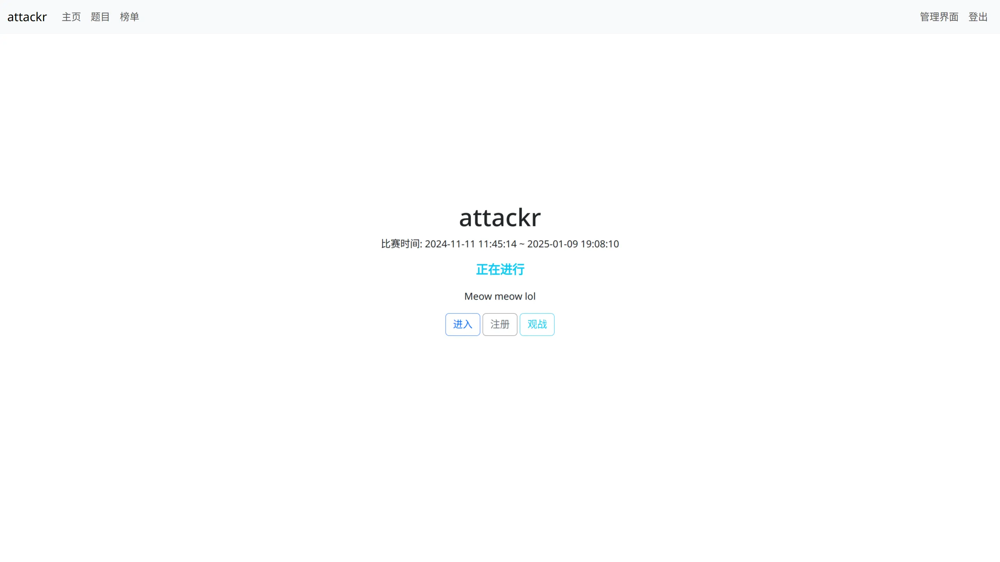
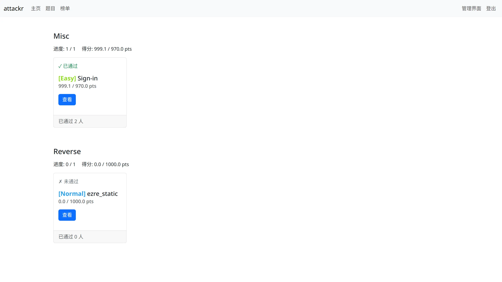
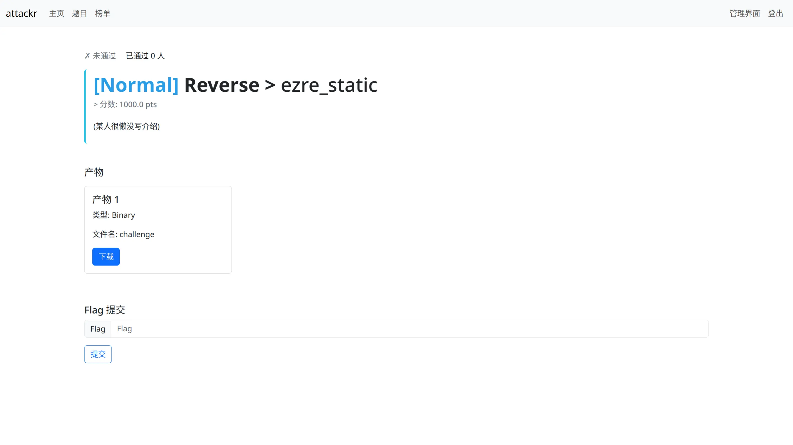
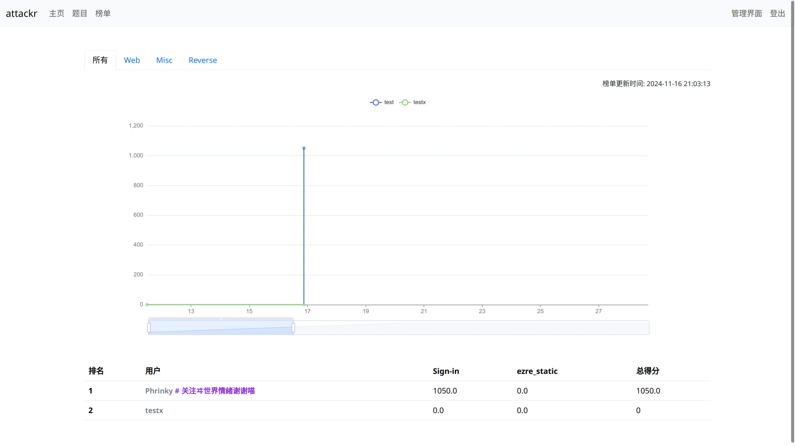

# attackr

## 简介

attackr 是使用 [Rust](https://www.rust-lang.org) + [Rocket](https://rocket.rs) + [MiniJinja](https://github.com/mitsuhiko/minijinja) 开发的 CTF 平台，并使用 [Koto](https://koto.dev/) 脚本语言实现动态积分及对用户倍数赋分支持。

由于设计限制，本平台只支持在单个实例上配置单个比赛，且不支持配置多实例进行负载平衡，适合小型比赛使用。

## 局限性

- 使用 SQLite 数据库，不适合大并发场景
- 只支持控制本机 Docker，无法实现多设备 Docker 负载平衡
- 不支持二进制产物及附件的内容分发
- 使用 SSR (服务端渲染)，对服务器性能有一定的消耗
- 不支持数据渲染分页面，在访问具有大量数据的页面下可能会导致浏览器卡顿
- 使用 JWT 进行会话验证，具有一定的风险，建议使用具有密码学安全的算法及密钥进行 JWT 的签发

## 功能

### 核心功能

- 主页
    - 可配置并显示比赛名称、介绍及时间 (支持调节时区)
    - 显示当前比赛状态
- 用户
    - 登录 / 注册用户
    - 查看用户主页
    - 修改用户信息
    - 支持通过 Gravatar 获取用户头像
    - 可在用户主页查看各题目的解题时间及得分情况
    - 可在用户主页查看各题集的解题及得分情况
    - 支持昵称中使用 Tag 并根据 Hash 设置 Tag 颜色
    - 支持在用户重置密码后无效化 JWT
    - 限制被禁用的用户进行登录及访问其他页面
    - 可配置用户注册审核
    - 可配置 JWT 密钥的算法及有效时间
- 题目
    - 静态题目 (Flag 在题目创建时确定) 
    - 动态题目 (Flag 在用户触发构建时确定)
    - Docker 镜像的构建及容器的启停
    - 二进制产物构建及下载
    - 重新构建动态题目
    - 支持 Markdown 题目描述
    - 支持区分题集 (可用于实现区分题目方向)
    - 支持区分难度 (可自定义难度的颜色)
    - 可配置脚本实现动态积分
    - 可配置脚本实现单个题目对指定排名的用户进行倍数赋分 (可用于实现前三血功能)
    - 支持单个题目多个产物 (包括二进制产物和 Docker 产物)
    - 显示题目当前通过人数及分数
    - 禁止用户在比赛前访问题目
    - 检验用户输入 Flag
    - 可配置题目及产物的储存路径
    - 可配置 Docker 监听的地址及端口 (支持 IPv4、IPv6)
    - 可配置 Docker 端口映射 (仅作为对用户的显示，并不能实现功能上的映射)
    - 可配置 Docker 容器自动销毁时间
    - 可限制 Docker 的 CPU、内存、储存占用
    - 可配置在题目解出后自动清理产物
    - 可配置题目是否公开
    - 可配置是否显示未分类题集的题目
- 榜单
    - 积分变化曲线 (可显示得分下降)
    - 用户排名及各题目得分表
    - 可显示各题集的分榜单
    - 禁止用户在比赛前访问榜单

### 管理员功能

- 用户
    - 修改用户信息 (包括权限组，在修改用户至管理员后将取消所有得分)
    - 重置用户 Random (重置后将会强制登出用户)
    - 启用 / 禁用用户 (禁用用户后用户将无法进行任何操作，并将取消所有得分)
    - 在去除取消得分的操作后可恢复用户得分
    - 按照启用 / 禁用情况区分用户
- 题目
    - 添加题目
    - 修改题目信息 (不支持修改题目源码及附件)
    - 查看题目详情 (包括构建脚本参数)
    - 批量公开题目
    - 重新计算题目分数及用户得分
- 产物
    - 查看产物信息
    - 删除用户产物
    - 重新构建产物
- 题集 (题目类别)
    - 添加 / 修改 / 删除题集
- 难度
    - 添加 / 修改 / 删除难度
- 提交记录
    - 查看用户提交记录
    - 可筛选指定用户 / 题目查看提交记录

## 截图

显示所有截图

## 构建

可直接运行仓库根目录下的 `build.sh` 进行构建，将会在根目录下产生 `attackr.tar.gz`。将内容解压至工作目录即可。

## 配置及脚本编写

参见 [examples](examples/) 中给出的示例。

## 运行

在编写好相应配置文件及脚本之后直接运行 `attackr` 即可。
